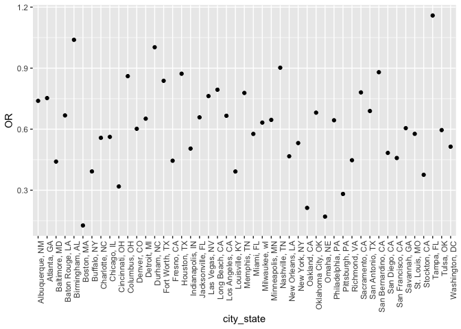

P8105 Homework 6
================
2018-11-27

**Context**: This assignment reinforces ideas in Linear Models.

Problem 1
---------

Create a `city_state` variable (e.g. “Baltimore, MD”), and a binary variable indicating whether the homicide is solved. Omit cities Dallas, TX; Phoenix, AZ; and Kansas City, MO – these don’t report victim race. Also omit Tulsa, AL – this is a data entry mistake. Modifiy victim\_race to have categories white and non-white, with white as the reference category. Be sure that victim\_age is numeric

``` r
homicide_df = read_csv("https://raw.githubusercontent.com/washingtonpost/data-homicides/master/homicide-data.csv", na = c("", "NA", "Unknown")) %>%
  mutate(
    city_state = str_c(city, state, sep = ", "),
    resolution = case_when(
      disposition == "Closed without arrest" ~ "unsolved",
      disposition == "Open/No arrest"        ~ "unsolved",
      disposition == "Closed by arrest"      ~ "solved"
    )
  ) %>% 
  filter(city_state != "Tulsa, AL", city_state != "Dallas, TX", city_state != "Phoenix, AZ", city_state != "Kansas City, MO") %>%
  mutate(victim_race = ifelse(victim_race != "White", "Non-White", "White"), 
         victim_race = fct_relevel(victim_race, "White"))
```

    ## Parsed with column specification:
    ## cols(
    ##   uid = col_character(),
    ##   reported_date = col_integer(),
    ##   victim_last = col_character(),
    ##   victim_first = col_character(),
    ##   victim_race = col_character(),
    ##   victim_age = col_integer(),
    ##   victim_sex = col_character(),
    ##   city = col_character(),
    ##   state = col_character(),
    ##   lat = col_double(),
    ##   lon = col_double(),
    ##   disposition = col_character()
    ## )

``` r
# Checked to see if `victim_age` is numeric
is.numeric(homicide_df$victim_age)
```

    ## [1] TRUE

``` r
# Confirmed that victim_age is numeric 
```

For the city of Baltimore, MD, use the glm function to fit a logistic regression with resolved vs unresolved as the outcome and victim age, sex and race (as just defined) as predictors. Save the output of glm as an R object; apply the broom::tidy to this object; and obtain the estimate and confidence interval of the adjusted odds ratio for solving homicides comparing non-white victims to white victims keeping all other variables fixed.

``` r
baltimore = homicide_df %>%
  filter(city_state == "Baltimore, MD") %>%
  mutate(solved = as.numeric(resolution == "solved")) %>%
  select(solved, victim_age, victim_race, victim_sex) %>%
  glm(solved ~ victim_age + victim_race + victim_sex, data = ., family = binomial())
  
baltimore %>% 
  broom::tidy() %>% 
  mutate(OR = exp(estimate)) %>%
  select(term, log_OR = estimate, OR, p.value) %>% 
  knitr::kable(digits = 3) 
```

| term                  |  log\_OR|     OR|  p.value|
|:----------------------|--------:|------:|--------:|
| (Intercept)           |    1.186|  3.274|    0.000|
| victim\_age           |   -0.007|  0.993|    0.032|
| victim\_raceNon-White |   -0.820|  0.441|    0.000|
| victim\_sexMale       |   -0.888|  0.412|    0.000|

``` r
confint(baltimore)
```

    ## Waiting for profiling to be done...

    ##                            2.5 %        97.5 %
    ## (Intercept)           0.73043530  1.6510015846
    ## victim_age           -0.01342427 -0.0006274281
    ## victim_raceNon-White -1.16423133 -0.4785692559
    ## victim_sexMale       -1.15576002 -0.6218668703

Now run glm for each of the cities in your dataset, and extract the adjusted odds ratio (and CI) for solving homicides comparing non-white victims to white victims. Do this within a “tidy” pipeline, making use of purrr::map, list columns, and unnest as necessary to create a dataframe with estimated ORs and CIs for each city.

``` r
allcities = homicide_df %>%
  mutate(solved = as.numeric(resolution == "solved")) %>%
  group_by(city_state) %>%
  nest() %>%
  mutate(allglms = map(data, ~glm(solved ~ victim_age + victim_race + victim_sex, data = ., family = binomial())),
             allresult = map(allglms, broom::tidy)) %>%
  select(-data, -allglms) %>%
  unnest() %>%
  filter(term == "victim_raceNon-White") %>%
  mutate(OR = exp(estimate)) %>%
  select(city_state, term, log_OR = estimate, OR, p.value) 
```

Create a plot that shows the estimated ORs and CIs for each city. Organize cities according to estimated OR, and comment on the plot.

``` r
allcities %>%
  ggplot(aes(x = city_state, y = OR)) + 
  geom_point() +
  theme(axis.text.x = element_text(angle = 90, hjust = 1))
```


