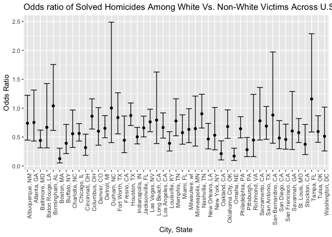
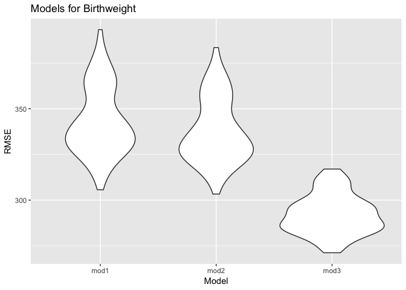

P8105 Homework 6
================
2018-11-27

**Context**: This assignment reinforces ideas in Linear Models.

Problem 1
---------

Create a `city_state` variable (e.g. “Baltimore, MD”), and a binary variable indicating whether the homicide is solved. Omit cities Dallas, TX; Phoenix, AZ; and Kansas City, MO – these don’t report victim race. Also omit Tulsa, AL – this is a data entry mistake. Modifiy victim\_race to have categories white and non-white, with white as the reference category. Be sure that victim\_age is numeric

``` r
# Loaded the dataset, created a binary variable, omitted the specific cities, and modified `victim_race` to be categorical
homicide = read_csv("https://raw.githubusercontent.com/washingtonpost/data-homicides/master/homicide-data.csv", na = c("", "NA", "Unknown")) %>%
  mutate(
    city_state = str_c(city, state, sep = ", "),
    resolution = case_when(
      disposition == "Closed without arrest" ~ "unsolved",
      disposition == "Open/No arrest"        ~ "unsolved",
      disposition == "Closed by arrest"      ~ "solved"
    )
  ) %>% 
  filter(city_state != "Tulsa, AL", city_state != "Dallas, TX", city_state != "Phoenix, AZ", city_state != "Kansas City, MO") %>%
  mutate(victim_race = ifelse(victim_race != "White", "Non-White", "White"), 
         victim_race = fct_relevel(victim_race, "White"))
```

    ## Parsed with column specification:
    ## cols(
    ##   uid = col_character(),
    ##   reported_date = col_integer(),
    ##   victim_last = col_character(),
    ##   victim_first = col_character(),
    ##   victim_race = col_character(),
    ##   victim_age = col_integer(),
    ##   victim_sex = col_character(),
    ##   city = col_character(),
    ##   state = col_character(),
    ##   lat = col_double(),
    ##   lon = col_double(),
    ##   disposition = col_character()
    ## )

``` r
# Checked to see if `victim_age` is numeric
is.numeric(homicide$victim_age)
```

    ## [1] TRUE

``` r
# Confirmed that victim_age is numeric 
```

For the city of Baltimore, MD, use the glm function to fit a logistic regression with resolved vs unresolved as the outcome and victim age, sex and race (as just defined) as predictors. Save the output of glm as an R object; apply the broom::tidy to this object; and obtain the estimate and confidence interval of the adjusted odds ratio for solving homicides comparing non-white victims to white victims keeping all other variables fixed.

``` r
baltimore = homicide %>%
  filter(city_state == "Baltimore, MD") %>%
  mutate(solved = as.numeric(resolution == "solved")) %>%
  select(solved, victim_age, victim_race, victim_sex) %>%
  glm(solved ~ victim_age + victim_race + victim_sex, data = ., family = binomial())
  
baltimore %>% 
  broom::tidy() %>% 
  mutate(OR = exp(estimate),
         CI_low = exp(estimate - (1.96 * std.error)),
         CI_high = exp(estimate + (1.96 * std.error))) %>%
  select(term, OR, p.value, CI_low, CI_high) %>% 
  knitr::kable(digits = 3) 
```

| term                  |     OR|  p.value|  CI\_low|  CI\_high|
|:----------------------|------:|--------:|--------:|---------:|
| (Intercept)           |  3.274|    0.000|    2.067|     5.186|
| victim\_age           |  0.993|    0.032|    0.987|     0.999|
| victim\_raceNon-White |  0.441|    0.000|    0.313|     0.620|
| victim\_sexMale       |  0.412|    0.000|    0.315|     0.537|

The odds of a homicide being solved for `Non-white` victims is 0.441 times the odds of a homicide being solved for `White` victims. There is a 95% confidence that the true odds ratio lies between 0.313 and 0.620.

Now run glm for each of the cities in your dataset, and extract the adjusted odds ratio (and CI) for solving homicides comparing non-white victims to white victims. Do this within a “tidy” pipeline, making use of purrr::map, list columns, and unnest as necessary to create a dataframe with estimated ORs and CIs for each city.

``` r
allcities = homicide %>%
  mutate(solved = as.numeric(resolution == "solved")) %>%
  group_by(city_state) %>%
  nest() %>%
  mutate(allglms = map(data, ~glm(solved ~ victim_age + victim_race + victim_sex, data = ., family = binomial())),
             allresult = map(allglms, broom::tidy)) %>%
  select(-data, -allglms) %>%
  unnest() %>%
  filter(term == "victim_raceNon-White") %>%
  mutate(OR = exp(estimate), 
         CI_low = exp(estimate - (1.96 * std.error)),
         CI_high = exp(estimate + (1.96 * std.error))) %>%
  select(city_state, OR, CI_low, CI_high)
```

Create a plot that shows the estimated ORs and CIs for each city. Organize cities according to estimated OR, and comment on the plot.

``` r
allcities %>%
  ggplot(aes(x = city_state, y = OR)) + 
  geom_point() +
  geom_errorbar(aes(ymin = CI_low, ymax = CI_high)) +
  theme(axis.text.x = element_text(angle = 90, hjust = 1)) +
  labs(
    title = "Odds ratio of Solved Homicides Among White Vs. Non-White Victims Across U.S. Cities",
    x = "City, State",
    y = "Odds Ratio")
```



From the plot above, across almost all the cities in our analysis the odds of a homicide being solved for `non-white` victims is lower than for `white` victims, with the except of Birmingham, Al, Durham, NC (on the null), and Tampa, Fl. We see a particularly large difference in the odds of solved homicides between non-white and white victim in Bostom, MA, Omaha, NE, and Oakland, CA.

Problem 2
---------

In this problem, I will analyze data gathered to understand the effects of several variables on a child’s birthweight. This dataset, consists of roughly 4000 children and includes the variables specified in the homework instructions.

Load and clean the data for regression analysis (i.e. convert numeric to factor where appropriate, check for missing data, etc.).

``` r
children = read_csv("data/birthweight.csv") %>% 
  mutate(babysex = as.factor(babysex),
         frace = as.factor(frace), 
         malform = as.factor(malform),
         mrace = as.factor(mrace),
         babysex = recode(babysex, "1" = "Male", "2" = "Female"),
         malform = recode(malform, "1" = "Present", "0" = "Absent"),
         frace = recode(frace, "1" = "White", "2" = "Black", "3" = "Asian", "4" = "Puerto Rican", "8" = "Other", "9" = "Unknown"),
         mrace = recode(mrace, "1" = "White", "2" = "Black", "3" = "Asian", "4" = "Puerto Rican", "8" = "Other"))
```

    ## Parsed with column specification:
    ## cols(
    ##   .default = col_integer(),
    ##   gaweeks = col_double(),
    ##   ppbmi = col_double(),
    ##   smoken = col_double()
    ## )

    ## See spec(...) for full column specifications.

``` r
# Check to identify any NAs in the dataset
sum(is.na(children))
```

    ## [1] 0

After I loaded the data, I cleaned the data in preparation for regression analysis. I chose to convert the columns `babysex`, `frace`, `malform`, and `mrace` into factors because the variables for them were either indicated as binary or categorical. I also recoded these columns from numbers to what they corresponded to for easier identification and reading.

Propose a regression model for birthweight. This model may be based on a hypothesized structure for the factors that underly birthweight, on a data-driven model-building process, or a combination of the two. Describe your modeling process and show a plot of model residuals against fitted values – use add\_predictions and add\_residuals in making this plot.

``` r
# Model Fitting: The model that I propose  has the outcome of interest as birthweight and the predictors as financial income `fincome`, baby's length at birth `blength`, and mother's age at delivery `momage`.
mod1 = children %>%
  lm(bwt ~ fincome + momage + blength, data = .)

# Tidying Output: Using broom package to obtain quick summaries of the model and to clean up the coefficient table
mod1  %>%
  broom::glance()
```

    ## # A tibble: 1 x 11
    ##   r.squared adj.r.squared sigma statistic p.value    df  logLik    AIC
    ## *     <dbl>         <dbl> <dbl>     <dbl>   <dbl> <int>   <dbl>  <dbl>
    ## 1     0.564         0.564  338.     1873.       0     4 -31445. 62900.
    ## # ... with 3 more variables: BIC <dbl>, deviance <dbl>, df.residual <int>

``` r
mod1 %>%
  broom::tidy() %>%
  select(term, estimate, p.value) %>%
  knitr::kable(digit = 3)
```

| term        |   estimate|  p.value|
|:------------|----------:|--------:|
| (Intercept) |  -3950.518|        0|
| fincome     |      1.584|        0|
| momage      |      6.742|        0|
| blength     |    137.851|        0|

``` r
# Diagnostics: Regression diagnostics will be used here to identify potential issues with the model fit. We will be creating and looking a a plot of residuals and fitted values
children %>% 
  modelr::add_residuals(mod1) %>%
  modelr::add_predictions(mod1) %>%
  ggplot(aes(x = resid, y = pred)) + 
  geom_point() + 
  labs(
    title = "Residuals and Fitted Values For Birthweights",
    x = "Residuals",
    y = "Predictions")
```


When we tidied the output, the estimates that we received were 1.58 for financial income, 6.74 for mother's age at delivery, and 137.851 for baby's length at birth. In the plot above `Residuals and Fitted Values For Birthweights`, we can see significant clustering centered approximately at 0 on the `Residual` axis and concentration between 2000 and 4000 on the `Prediction` axis.

Compare your model to two others:

-   One using length at birth and gestational age as predictors (main effects only)
-   One using head circumference, length, sex, and all interactions (including the three-way interaction) between these

Make this comparison in terms of the cross-validated prediction error; use crossv\_mc and functions in purrr as appropriate.

Note that although we expect your model to be reasonable, model building itself is not a main idea of the course and we don’t necessarily expect your model to be “optimal”.

``` r
# The three models are listed below and I will plot the three models to get an idea of goodness of fit.
mod1 = lm(bwt ~ fincome + momage + blength, data = children)
mod2 = lm(bwt ~ blength + gaweeks, data = children)
mod3 = lm(bwt ~ bhead + blength + babysex + bhead*blength + bhead*babysex + blength*babysex + bhead*blength*babysex, data = children)

children %>% 
  gather_predictions(mod1, mod2, mod3) %>% 
  mutate(model = fct_inorder(model)) %>% 
  ggplot(aes(x = blength, y = bwt)) + 
  geom_point(alpha = .5) +
  geom_line(aes(y = pred), color = "red") + 
  facet_grid(~model)
```


``` r
# CV using modelr
cv = crossv_mc(children, 100)

# Using the training and testing datasets, I will fit my candidate models and assess prediction accuracy, using `mutate`, `map`, and `map2`
cv %>% pull(train) %>% .[[1]] %>% as_tibble
```

    ## # A tibble: 3,473 x 20
    ##    babysex bhead blength   bwt delwt fincome frace gaweeks malform menarche
    ##    <fct>   <int>   <int> <int> <int>   <int> <fct>   <dbl> <fct>      <int>
    ##  1 Female     34      51  3629   177      35 White    39.9 Absent        13
    ##  2 Male       34      48  3062   156      65 Black    25.9 Absent        14
    ##  3 Male       34      52  3062   157      55 White    40   Absent        14
    ##  4 Female     34      52  3374   156       5 White    41.6 Absent        13
    ##  5 Male       33      52  3374   129      55 White    40.7 Absent        12
    ##  6 Female     33      46  2523   126      96 Black    40.3 Absent        14
    ##  7 Female     33      49  2778   140       5 White    37.4 Absent        12
    ##  8 Male       36      52  3515   146      85 White    40.3 Absent        11
    ##  9 Male       33      50  3459   169      75 Black    40.7 Absent        12
    ## 10 Male       35      51  3459   146      55 White    39.4 Absent        12
    ## # ... with 3,463 more rows, and 10 more variables: mheight <int>,
    ## #   momage <int>, mrace <fct>, parity <int>, pnumlbw <int>, pnumsga <int>,
    ## #   ppbmi <dbl>, ppwt <int>, smoken <dbl>, wtgain <int>

``` r
cv %>% pull(test) %>% .[[1]] %>% as_tibble
```

    ## # A tibble: 869 x 20
    ##    babysex bhead blength   bwt delwt fincome frace gaweeks malform menarche
    ##    <fct>   <int>   <int> <int> <int>   <int> <fct>   <dbl> <fct>      <int>
    ##  1 Female     36      50  3345   148      85 White    39.9 Absent        12
    ##  2 Female     35      51  3317   130      55 White    43.4 Absent        13
    ##  3 Male       36      53  3629   147      75 White    41.3 Absent        11
    ##  4 Female     35      57  3374   147      45 White    39.6 Absent        12
    ##  5 Male       34      52  3203   134      25 White    41.1 Absent        14
    ##  6 Male       34      49  3175   148      96 Black    39.7 Absent        10
    ##  7 Female     36      56  3685   170      95 White    40.3 Absent        12
    ##  8 Male       35      53  3175   130      45 White    40.4 Absent        13
    ##  9 Female     34      54  3345   130      95 White    42.1 Absent        10
    ## 10 Female     34      51  3232   155      55 White    41.6 Absent        15
    ## # ... with 859 more rows, and 10 more variables: mheight <int>,
    ## #   momage <int>, mrace <fct>, parity <int>, pnumlbw <int>, pnumsga <int>,
    ## #   ppbmi <dbl>, ppwt <int>, smoken <dbl>, wtgain <int>

``` r
cv = cv %>% 
  mutate(train = map(train, as_tibble),
         test = map(test, as_tibble))

cv = cv %>% 
  mutate(mod1 = map(train, ~lm(bwt ~ fincome + momage + blength, data = .x)),
         mod2 = map(train, ~lm(bwt ~ blength + gaweeks, data = .x)),
         mod3 = map(train, ~lm(bwt ~ bhead + blength + babysex + bhead*blength + bhead*babysex + blength*babysex + bhead*blength*babysex, data = .x)),
         rmse_mod1 = map2_dbl(mod1, test, ~rmse(model = .x, data = .y)),
         rmse_mod2 = map2_dbl(mod2, test, ~rmse(model = .x, data = .y)),
         rmse_mod3 = map2_dbl(mod3, test, ~rmse(model = .x, data = .y)))

# Plotted distribution of RMSE values for each model
cv %>% 
  select(starts_with("rmse")) %>% 
  gather(key = model, value = rmse) %>% 
  mutate(model = str_replace(model, "rmse_", ""),
         model = fct_inorder(model)) %>% 
  ggplot(aes(x = model, y = rmse)) + 
  geom_violin() +
  labs(
  title = "Models for Birthweight",
  x = "Model",
  y = "RMSE")
```



From the violin plot above, we can see that model 1 and model 2 have similar shape and distribution, however model 3 that looks at head circumference, length, sex, and all interactions (including the three-way interaction) is different. It has lower RMSE and a wider shape.
